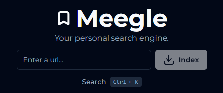

<div align='center'>

<h1>Meegle</h1>

<p>Your personal search engine</p>



<br />
<br />


[](https://opensource.org/licenses/MIT)

</div>

## Quick Start

```bash
git clone https://github.com/hazelnutcloud/meegle.git
cd meegle
bun install
bun dev
```

1. Open [localhost:5173](http://localhost:5173) in your browser.

2. Enter a url and click "Index" to index the page.

3. Search for your indexed pages by opening up the search panel and typing in a search query.

## Notes

- Search is currently inaccurate due to https://github.com/lancedb/lancedb/issues/882#issuecomment-1949558198. Currently, it just returns all indexed pages. Once the issue is resolved, search will be accurate.
